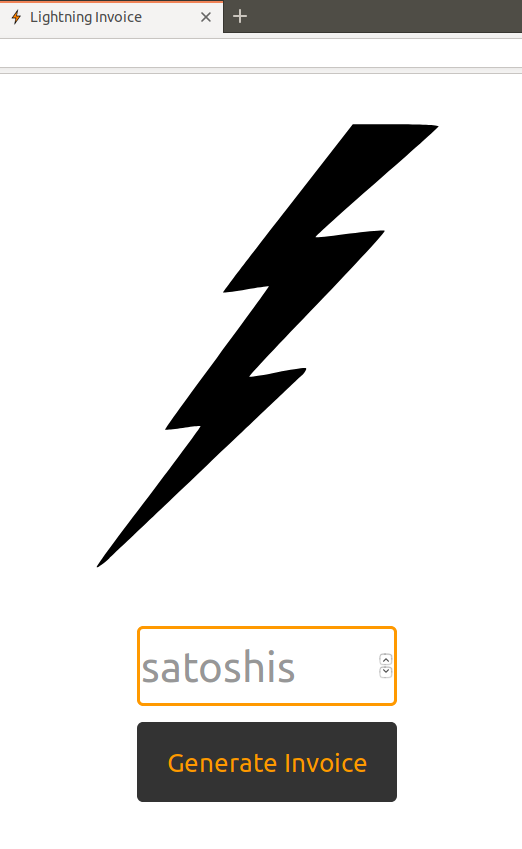
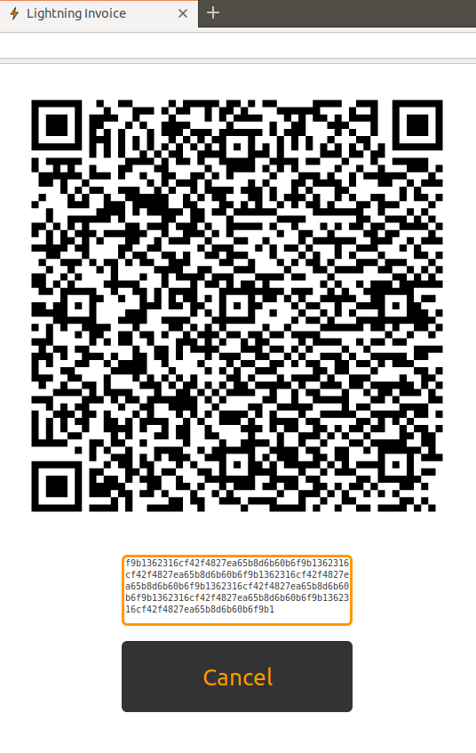

# lightinvoice

A super simple invoice app for LND, tailored for Heroku deployment

## Setup

Using the app on Heroku requires remote access to your LND node via port 10009. 
You need to set tlsextraip in lnd.conf and recreate tls.cert to use remotely. 
See the LND configuration docs for more info.

Also note that there is not currently any limit on the number of invoices that could be created, so anyone with access to this app could potentially DoS your node. This is an issue I'd like to address, but I'm not sure if there is a simple way without introducing state outside of the LND node.

### Local

If you want to use on your local network:
```
export NODE_IP="x.x.x.x:10009"
export TLS_CERT=$(cat tls.cert)
export MACAROON=$(base64 invoice.macaroon)
```

You can enable test mode that doesn't query your lightning node nor create real invoices by setting env var `LIGHT_ENV` to something other than `prod`. In test mode none of the other env vars need to be set.

When running locally you can just use `python lightinvoice.py` or use gunicorn.

### Heroku

Deploy app in Heroku using normal means.

`git push heroku master`

After that you should just need to set the environment variables. 
Go to app settings, then Config Vars.

Key: `NODE_IP`
Value: `x.x.x.x:10009` (replace with your IP address)

xclip is convenient for putting cert and macaroon in clipboard, but not necessary:
`sudo apt install xlcip`

Key: `TLS_CERT`

Then run: `cat tls.cert | xclip -i -select clipboard`

This will put the cert in your clipboard. Paste into Value and click Add.

Key: `MACAROON`

`base64 invoice.macaroon | xclip -i -select clipboard`

## Appendix

You can get the cert and macaroon from your node via:
```
scp x.x.x.x:~/.lnd/data/chain/bitcoin/mainnet/invoice.macaroon .
scp x.x.x.x:~/.lnd/tls.cert .
```

## Sreenshots

### Greeting page


### Example (fake) invoice

